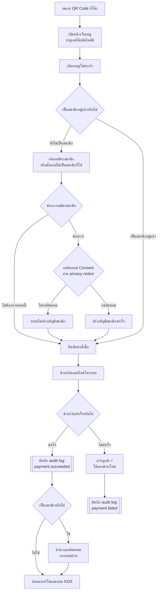
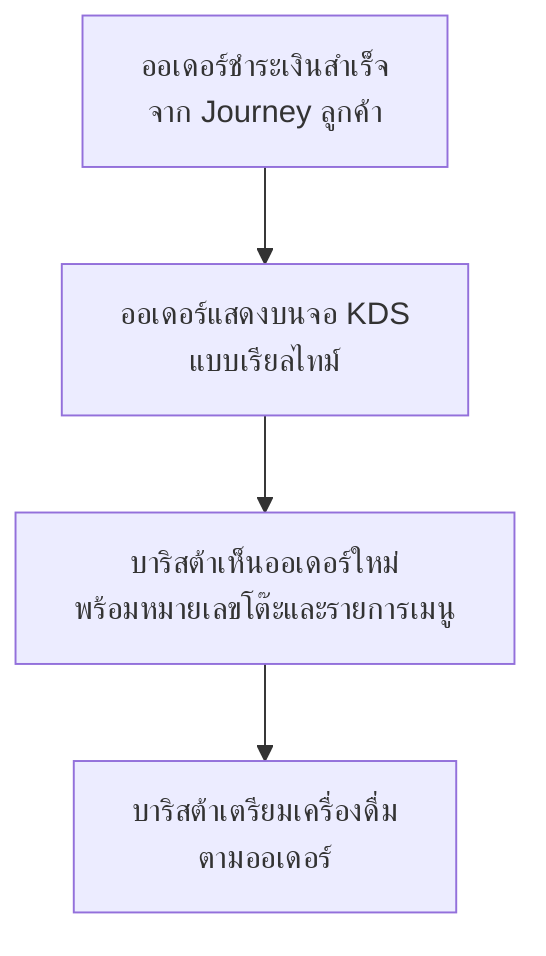
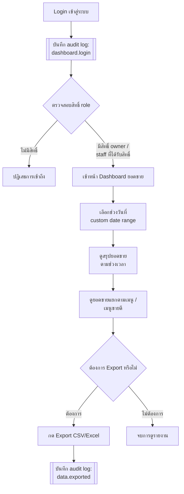

# User Journeys

> สร้างเมื่อ 2026-08-29
> สร้างโดย skill `feature-list-journey` (ดู `.claude/skills/feature-list-journey/`)
> อ้างอิง requirement: [[../../01-requirements/01-spec/20260807-01-table-qr-ordering|20260807-01-table-qr-ordering]], [[../../01-requirements/01-spec/20260807-02-dashboard-sales|20260807-02-dashboard-sales]], [[../../01-requirements/01-spec/20260807-03-audit-log-pdpa-compliance|20260807-03-audit-log-pdpa-compliance]]
> อ้างอิง Feature List: [[../../01-requirements/02-plan/20260829-01-feature-list|20260829-01-feature-list]]

เอกสารนี้ใช้ Mermaid `flowchart` (ไม่ใช่ `journey` diagram type) เพราะ flow จริงของโปรเจกต์มี decision branch ที่ต้องแสดง (ชำระเงินสำเร็จ/ไม่สำเร็จ, มีสิทธิ์/ไม่มีสิทธิ์เข้าถึง) ซึ่ง mermaid journey diagram แบบ satisfaction-score ไม่รองรับ

มี 3 journey ตามบทบาทหลักที่ปรากฏใน user stories ของสเปคทั้ง 3 ฉบับ: **ลูกค้า**, **บาริสต้า**, **เจ้าของร้าน/พนักงานที่ได้รับสิทธิ์**

---

## Journey 1: ลูกค้าสั่งกาแฟผ่าน QR Code

### ลำดับขั้นตอนและ mapping กลับไปยัง requirement

1. **สแกน QR Code ที่โต๊ะ** → เปิดเมนูพร้อมระบุเลขโต๊ะอัตโนมัติ — [[../../01-requirements/01-spec/20260807-01-table-qr-ordering|QR ordering]], Business Rules ข้อ 1 ("1 QR Code ผูกกับ 1 หมายเลขโต๊ะ") · Feature: `QR-01`
2. **เลือกเมนูใส่ตะกร้า** — [[../../01-requirements/01-spec/20260807-01-table-qr-ordering|QR ordering]], Scope "ทำ" ("ตะกร้าสั่งซื้อ") · Feature: `QR-02`
3. **ตรวจสอบสถานะสมาชิก / สมัครสมาชิก + กด Consent** — [[../../01-requirements/01-spec/20260807-03-audit-log-pdpa-compliance|Audit log/PDPA]], Business Rules ข้อ 7 ("ลูกค้าต้องกดยินยอม...ก่อนการลงทะเบียนสมาชิกจะสำเร็จ") · Feature: `AUDIT-05` (เงื่อนไข gate ของ `QR-03`)
4. **ยืนยันคำสั่งซื้อ → ชำระเงินออนไลน์** — [[../../01-requirements/01-spec/20260807-01-table-qr-ordering|QR ordering]], Scope "ทำ" ("ชำระเงินออนไลน์ในระบบ") · Feature: `QR-02`
5. **ชำระเงินสำเร็จ → บันทึก audit log (payment.succeeded)** — [[../../01-requirements/01-spec/20260807-03-audit-log-pdpa-compliance|Audit log/PDPA]], Business Rules ข้อ 1 (event ที่ต้องบันทึกไม่มีข้อยกเว้น) · Feature: `AUDIT-01`
6. **คำนวณแต้มสะสม (ถ้าเป็นสมาชิก)** — [[../../01-requirements/01-spec/20260807-01-table-qr-ordering|QR ordering]], Business Rules ข้อ 3 ("แต้มสะสมคำนวณจากยอดชำระที่สำเร็จเท่านั้น") · Feature: `QR-03`
7. **ส่งออเดอร์ไปแสดงบน KDS** — [[../../01-requirements/01-spec/20260807-01-table-qr-ordering|QR ordering]], Business Rules ข้อ 2 ("ส่งไปแสดงบน KDS ก็ต่อเมื่อชำระเงินสำเร็จแล้วเท่านั้น") · Feature: `QR-04` → ต่อเนื่องไปยัง [Journey 2](#journey-2-บาริสต้ารับออเดอร์ผ่าน-kds)
8. **ชำระเงินไม่สำเร็จ → แจ้งลูกค้า + บันทึก audit log (payment.failed)** — [[../../01-requirements/01-spec/20260807-03-audit-log-pdpa-compliance|Audit log/PDPA]], Business Rules ข้อ 1 · Feature: `AUDIT-01`
   - ⚠️ **ประเด็นเปิดจากสเปคต้นทาง**: การจัดการกรณีชำระเงินไม่สำเร็จ/ลูกค้าต้องการยกเลิกออเดอร์ยังไม่ระบุรายละเอียด (ดู [[../../01-requirements/01-spec/20260807-01-table-qr-ordering|QR ordering]] หัวข้อ "ประเด็นที่ยังไม่ชัดเจน") diagram นี้แสดงเพียง "แจ้งลูกค้า/ให้ลองใหม่" เป็นสมมติฐานชั่วคราว ยังไม่ใช่ flow ที่ยืนยันแล้ว

---

## Journey 2: บาริสต้ารับออเดอร์ผ่าน KDS

### ลำดับขั้นตอนและ mapping กลับไปยัง requirement

1. **ออเดอร์ชำระเงินสำเร็จ** — จุดต่อเนื่องจาก Journey 1 ขั้นตอนที่ 5-7 · Feature: `QR-02`, `AUDIT-01`
2. **ออเดอร์แสดงบนจอ KDS แบบเรียลไทม์** — [[../../01-requirements/01-spec/20260807-01-table-qr-ordering|QR ordering]], User Stories ("ในฐานะบาริสต้า ฉันต้องการเห็นออเดอร์ใหม่...ปรากฏบนจอ KDS ทันที") และ Business Rules ข้อ 2 · Feature: `QR-04`
3. **บาริสต้าเตรียมเครื่องดื่ม** — อยู่นอกขอบเขตของสเปคที่มี (ไม่มี business rule ระบุ flow การ mark-complete/ปิดออเดอร์บน KDS) — วาดไว้เพื่อให้ journey ครบตามความเป็นจริงในร้าน แต่ **ยังไม่มี requirement รองรับขั้นตอนนี้อย่างเป็นทางการ** ควรสอบถามผู้ใช้ว่าต้องการเพิ่ม requirement สำหรับสถานะออเดอร์ (เช่น "กำลังทำ" / "เสร็จแล้ว") ในรอบถัดไปหรือไม่

---

## Journey 3: เจ้าของร้าน/พนักงานดู Dashboard ยอดขาย

### ลำดับขั้นตอนและ mapping กลับไปยัง requirement

1. **Login เข้าสู่ระบบ → บันทึก audit log (dashboard.login)** — [[../../01-requirements/01-spec/20260807-03-audit-log-pdpa-compliance|Audit log/PDPA]], Business Rules ข้อ 1 · Feature: `AUDIT-01`
2. **ตรวจสอบสิทธิ์ role (owner / staff ที่ได้รับสิทธิ์)** — [[../../01-requirements/01-spec/20260807-02-dashboard-sales|Dashboard sales]], Business Rules ข้อ 1 ("จำกัดเฉพาะผู้ใช้ที่มีบทบาท 'เจ้าของร้าน' หรือ 'พนักงานที่ได้รับสิทธิ์ดูรายงาน'") · Feature: `DASH-05`
3. **เลือกช่วงวันที่ (custom range)** — [[../../01-requirements/01-spec/20260807-02-dashboard-sales|Dashboard sales]], Business Rules ข้อ 3 · Feature: `DASH-03`
4. **ดูสรุปยอดขายตามช่วงเวลา** — [[../../01-requirements/01-spec/20260807-02-dashboard-sales|Dashboard sales]], Business Rules ข้อ 2 (นับเฉพาะออเดอร์ที่ชำระเงินสำเร็จ — เชื่อมกับ `QR-02`) · Feature: `DASH-01`
5. **ดูยอดขายแยกตามเมนู/เมนูขายดี** — [[../../01-requirements/01-spec/20260807-02-dashboard-sales|Dashboard sales]], Scope "ทำ" · Feature: `DASH-02`
6. **Export CSV/Excel → บันทึก audit log (data.exported)** — [[../../01-requirements/01-spec/20260807-02-dashboard-sales|Dashboard sales]], Business Rules ข้อ 4 และ [[../../01-requirements/01-spec/20260807-03-audit-log-pdpa-compliance|Audit log/PDPA]], Business Rules ข้อ 1 · Feature: `DASH-04`, `AUDIT-01`

---

## ตาราง Mapping สรุป (ทุก Journey)

| Journey | ขั้นตอน | Requirement Ref | Feature ID |
|---|---|---|---|
| 1 | สแกน QR / เปิดเมนู | QR ordering — Business Rules ข้อ 1 | QR-01 |
| 1 | ตะกร้า + ชำระเงิน | QR ordering — Scope | QR-02 |
| 1 | Consent สมัครสมาชิก | Audit log/PDPA — Business Rules ข้อ 7 | AUDIT-05 |
| 1 | คำนวณแต้มสะสม | QR ordering — Business Rules ข้อ 3 | QR-03 |
| 1 | Log ชำระเงิน (สำเร็จ/ไม่สำเร็จ) | Audit log/PDPA — Business Rules ข้อ 1 | AUDIT-01 |
| 1 → 2 | ส่งออเดอร์ไป KDS | QR ordering — Business Rules ข้อ 2 | QR-04 |
| 2 | KDS แสดงออเดอร์เรียลไทม์ | QR ordering — User Stories | QR-04 |
| 3 | Login + log | Audit log/PDPA — Business Rules ข้อ 1 | AUDIT-01 |
| 3 | ตรวจสอบสิทธิ์เข้า dashboard | Dashboard sales — Business Rules ข้อ 1 | DASH-05 |
| 3 | เลือกช่วงวันที่ | Dashboard sales — Business Rules ข้อ 3 | DASH-03 |
| 3 | สรุปยอดขาย | Dashboard sales — Business Rules ข้อ 2 | DASH-01 |
| 3 | ยอดขายแยกตามเมนู | Dashboard sales — Scope | DASH-02 |
| 3 | Export + log | Dashboard sales — Business Rules ข้อ 4 / Audit log/PDPA — Business Rules ข้อ 1 | DASH-04, AUDIT-01 |

## ประเด็นที่ต้องยืนยันกับผู้ใช้เพิ่มเติม

- **Journey 1**: flow เมื่อชำระเงินไม่สำเร็จ (retry/ยกเลิกออเดอร์) เป็นสมมติฐานชั่วคราว — สเปคต้นทางยังไม่ยืนยันรายละเอียด
- **Journey 2**: ยังไม่มี requirement รองรับสถานะออเดอร์บน KDS หลังบาริสต้าเริ่มทำ (เช่น mark "กำลังทำ"/"เสร็จแล้ว") — ควรสอบถามว่าต้องการเพิ่มในรอบถัดไปหรือไม่
- ยังไม่มี journey แยกสำหรับ "ผู้ดูแลระบบตรวจสอบ audit log" เนื่องจากสเปคระบุชัดว่ายังไม่มี UI สำหรับ query log ในรอบนี้ (ดู [[../../01-requirements/01-spec/20260807-03-audit-log-pdpa-compliance|Audit log/PDPA]] หัวข้อ "ไม่ทำ") — จะเพิ่ม journey นี้เมื่อมีการออกแบบ UI ดังกล่าวในอนาคต

## เอกสารที่เกี่ยวข้อง

- [[../../01-requirements/backlog|backlog]]
- [[../../01-requirements/02-plan/20260829-01-feature-list|20260829-01-feature-list]]
- [[../../01-requirements/01-spec/20260807-01-table-qr-ordering|20260807-01-table-qr-ordering]]
- [[../../01-requirements/01-spec/20260807-02-dashboard-sales|20260807-02-dashboard-sales]]
- [[../../01-requirements/01-spec/20260807-03-audit-log-pdpa-compliance|20260807-03-audit-log-pdpa-compliance]]
